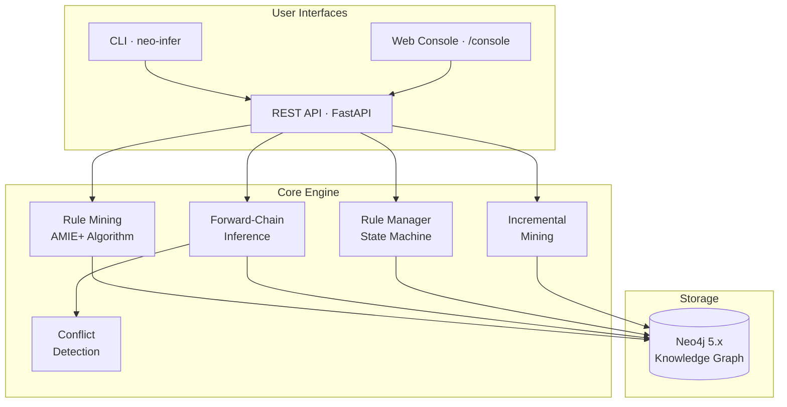

<div align="center">

# neo-infer

**Automatic rule mining and inference for Neo4j knowledge graphs**

Discover Horn clause rules like `bornIn(X,Z) ^ locatedIn(Z,Y) -> nationality(X,Y)` directly from your graph, then apply them to infer new relationships.

[](https://github.com/zxr19980213/neo-infer/actions/workflows/ci.yml)
[](LICENSE)
[](https://www.python.org/downloads/)
[](https://neo4j.com/)

</div>

## Why neo-infer?

Knowledge graphs are always incomplete. Manually writing rules to fill the gaps doesn't scale. Existing AMIE implementations are academic prototypes — not production services.

**neo-infer** implements the [AMIE+](https://www.mpi-inf.mpg.de/departments/databases-and-information-systems/research/yago-naga/amie/) algorithm as a ready-to-use FastAPI service backed by Neo4j:

- **No data export** — runs queries directly against your Neo4j database, no ETL pipeline needed
- **Full rule lifecycle** — discover rules, review them, adopt or reject, then apply with state machine enforcement
- **Incremental mining** — as your graph changes, delta-based re-mining keeps rules fresh without full recomputation
- **Production-ready** — REST API, CLI, browser console, conflict detection, and 35 automated tests

## Architecture



## Quick Start

### Prerequisites

- Python >= 3.10
- Neo4j 5.x (Community Edition works; password must be >= 8 characters)

### Install & Run

```bash
pip install -e .
export NEO4J_URI="bolt://localhost:7687"
export NEO4J_USER="neo4j"
export NEO4J_PASSWORD="your_password"
uvicorn main:app --reload
```

Open http://localhost:8000/console for the web UI, or use the CLI:

```bash
neo-infer health
neo-infer mine --body-length 2 --limit 100 --min-support 1 --min-pca-confidence 0.1
neo-infer rules list --status discovered
neo-infer infer --limit-rules 100
```

### 5-Minute Walkthrough

```bash
# 1. Seed sample data
cypher-shell -a bolt://localhost:7687 -u neo4j -p your_password '
CREATE (a:Entity {id:"alice"}), (b:Entity {id:"bob"}),
       (bj:Entity {id:"beijing"}), (sh:Entity {id:"shanghai"}),
       (cn:Entity {id:"china"});
CREATE (a)-[:bornIn]->(bj), (b)-[:bornIn]->(sh),
       (bj)-[:locatedIn]->(cn), (sh)-[:locatedIn]->(cn),
       (a)-[:nationality]->(cn);'

# 2. Mine rules — discovers: bornIn(X,Z) ^ locatedIn(Z,Y) -> nationality(X,Y)
curl -X POST http://localhost:8000/rules/mine \
  -H "Content-Type: application/json" \
  -d '{"body_length":2, "limit":100, "min_support":1, "min_pca_confidence":0.1}'

# 3. Adopt the discovered rule
curl -X POST http://localhost:8000/rules/rule__bornin__locatedin__to__nationality/adopt

# 4. Run inference -> bob now gets nationality->china (inferred!)
curl -X POST http://localhost:8000/inference/run \
  -H "Content-Type: application/json" \
  -d '{"limit_rules":100, "fixpoint":false}'
```

## Features

| Feature | Description |
|---------|-------------|
| Rule Mining | AMIE+ algorithm, body length 2~5, with beam search and pruning |
| Inference | Single-round and fixpoint forward-chaining, with conflict detection |
| Rule Lifecycle | State machine: `discovered -> adopted -> applied` / `rejected` |
| Incremental Mining | ChangeLog-driven delta mining with cursor-based consumption |
| Web Console | Browser UI at `/console` for mining, rule management, inference |
| CLI | `neo-infer` command for all operations |
| Trigger Support | APOC trigger for auto-capturing graph mutations (Neo4j 4.x/5.x) |
| Benchmarking | Built-in scripts for API performance and index strategy testing |

## Rule Mining Parameters

| Parameter | Default | Description |
|-----------|---------|-------------|
| `body_length` | 2 | Path hops (2~5). Length 2/3 use optimized queries; 4/5 use dynamic Cypher. |
| `min_support` | 5 | Minimum support count |
| `min_pca_confidence` | 0.1 | Minimum PCA confidence threshold |
| `factual_only` | true | Exclude inferred edges from statistics |
| `beam_width` | - | Top-B body candidates per level |
| `head_budget_per_relation` | - | Max K rules per head relation |
| `candidate_limit` | - | Max total candidates to evaluate |

## Rule State Machine

```
discovered ──[adopt]──> adopted ──[inference]──> applied (terminal)
     │                      │
     └──────[reject]────────┴──────────────────> rejected (terminal)
```

API enforces transitions: invalid transitions return `409 Conflict`, missing rules return `404`.

## Documentation

| Document | Content |
|----------|---------|
| [API Reference](docs/api-reference.md) | All endpoints, parameters, request/response examples |
| [Configuration](docs/configuration.md) | Environment variables, Neo4j/APOC setup, schema |
| [Testing & Benchmarks](docs/testing.md) | Automated tests, manual testing guide, benchmarks |
| [Architecture & Roadmap](docs/architecture.md) | Algorithm design, implementation plan, status |

## Development

```bash
pip install -e ".[dev]"
pytest -q              # 35 tests, all mocked (no Neo4j needed)
uvicorn main:app --reload  # dev server with hot reload
```

See [CONTRIBUTING.md](CONTRIBUTING.md) for development guidelines.

## Support This Project

If neo-infer is useful to your work, consider supporting its development:

<div align="center">

**Alipay (支付宝)**


</div>

You can also star the repo — it helps others discover the project!

## License

[MIT](LICENSE)
