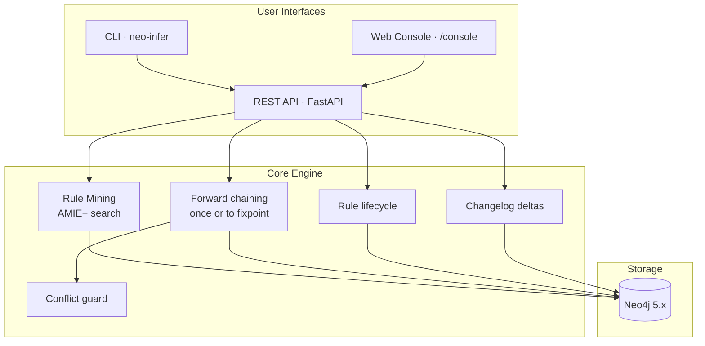

<div align="center">

# 🔮 neo-infer

**Your Neo4j graph, learning the rules it already implies.**

Mine Horn clauses from live data, review them, then write the missing facts back — with a source rule, a confidence, and a way to take them back.

[](https://github.com/zxr19980213/neo-infer/actions/workflows/ci.yml)
[](LICENSE)
[](https://www.python.org/downloads/)
[](https://neo4j.com/)

<br/>

`AMIE+ search` · `PCA confidence` · `forward chaining` · `changelog deltas` · `branching & constants`

</div>

---

## ✨ See it fill a gap

```
   BEFORE                                    AFTER
   ──────                                    ─────
   alice ──bornIn──▶ beijing                 alice ──bornIn──▶ beijing
   bob   ──bornIn──▶ shanghai                bob   ──bornIn──▶ shanghai
   beijing  ─locatedIn─▶ china               beijing  ─locatedIn─▶ china
   shanghai ─locatedIn─▶ china               shanghai ─locatedIn─▶ china
   alice ──nationality──▶ china              alice ──nationality──▶ china
                                        ⚡    bob   ──nationality──▶ china   ← inferred
```

The graph never stored **bob’s nationality**. neo-infer mined

`bornIn(X,Z) ∧ locatedIn(Z,Y) → nationality(X,Y)`

from the facts already there, then applied it. The new edge carries `source_rule_id`, `confidence`, and `inferred_at`.

## 💎 Why this, on a live graph

Academic AMIE+ shows that incomplete knowledge graphs can grow their own rules. neo-infer is that search, pointed at the database you already run.

| | |
|---|---|
| **Stays in Neo4j** | Support, PCA confidence, and head coverage are Cypher. The graph is the index. |
| **Rules you can read** | Chains, branches, and constants come back as Horn text, ranked by how much of the head they explain. |
| **A real lifecycle** | Discover, adopt, apply, reject. The server refuses illegal transitions. Rejecting an applied rule pulls its inferred edges back. |
| **Keeps up with edits** | A changelog of adds and removes updates rule stats from the delta. Inferred edges stay out of the training counts. |
| **Safe to apply** | Conflicts block materialization. Unsupported inferred edges are retracted before the next round writes anything new. |

## 🧠 Rules it actually searches

**Chain** — the classic two-hop path, and the same metrics out to body length 5.

```text
bornIn(X,Z) ∧ locatedIn(Z,Y) → nationality(X,Y)
```

**Branch** — a shared neighbor, written as an inverse hop (`^`).

```text
parent(Z,X) ∧ parent(Z,Y) → sibling(X,Y)
```

**Constant** — the join node is fixed, written `relation@nodeId`.

```text
bornIn(X, beijing) ∧ locatedIn(beijing, Y) → nationality(X,Y)
```

Search prunes with beam width, a per-head budget, and a confidence upper bound. `factual_only` (on by default) ignores edges this engine already inferred, so old conclusions cannot inflate the next round of statistics.

## 🚀 Quick start

Python ≥ 3.10 and Neo4j 5.x. Community Edition is enough. The password must be at least 8 characters.

```bash
pip install -e .
export NEO4J_URI="bolt://localhost:7687"
export NEO4J_USER="neo4j"
export NEO4J_PASSWORD="your_password"
uvicorn main:app --reload
```

Open **http://localhost:8000/console**, or use the CLI:

```bash
neo-infer health
neo-infer mine --body-length 2 --limit 100 --min-support 1 --min-pca-confidence 0.1
neo-infer rules list --status discovered
neo-infer infer --limit-rules 100
```

### Five minutes, end to end

```bash
cypher-shell -a bolt://localhost:7687 -u neo4j -p your_password '
CREATE (a:Entity {id:"alice"}), (b:Entity {id:"bob"}),
       (bj:Entity {id:"beijing"}), (sh:Entity {id:"shanghai"}),
       (cn:Entity {id:"china"});
CREATE (a)-[:bornIn]->(bj), (b)-[:bornIn]->(sh),
       (bj)-[:locatedIn]->(cn), (sh)-[:locatedIn]->(cn),
       (a)-[:nationality]->(cn);'

curl -X POST http://localhost:8000/rules/mine \
  -H "Content-Type: application/json" \
  -d '{"body_length":2, "limit":100, "min_support":1, "min_pca_confidence":0.1}'

curl -X POST http://localhost:8000/rules/rule__bornin__locatedin__to__nationality/adopt

curl -X POST http://localhost:8000/inference/run \
  -H "Content-Type: application/json" \
  -d '{"limit_rules":100, "fixpoint":false}'
```

Bob now has `nationality → china`, marked inferred.

## 🧩 How it fits together


```mermaid
graph TB
    subgraph User Interfaces
        CLI["CLI · neo-infer"]
        API["REST API · FastAPI"]
        Console["Web Console · /console"]
    end

    subgraph Core Engine
        Mining["Rule Mining<br/>AMIE+ search"]
        Inference["Forward chaining<br/>once or to fixpoint"]
        RuleMgmt["Rule lifecycle"]
        Incremental["Changelog deltas"]
        Conflict["Conflict guard"]
    end

    subgraph Storage
        Neo4j[("Neo4j 5.x")]
    end

    CLI --> API
    Console --> API
    API --> Mining
    API --> Inference
    API --> RuleMgmt
    API --> Incremental
    Inference --> Conflict
    Mining --> Neo4j
    Inference --> Neo4j
    RuleMgmt --> Neo4j
    Incremental --> Neo4j
```

## 🎁 What you get

| | |
|---|---|
| **Mining** | Body length 2–5. Length 2 and 3 use dedicated queries; longer chains use the same support / PCA / head-coverage metrics. |
| **Language** | Forward chains, inverse branches (`^`), and instantiated joins (`rel@nodeId`). |
| **Inference** | One round, or fixpoint up to a max iteration. Every new edge names the rule that wrote it. |
| **Lifecycle** | `discovered → adopted → applied`, and `reject` from any of those three. Applied is allowed to leave, and its edges go with it. |
| **Incremental** | App changelog plus an optional APOC trigger. Length 2, 3, and longer bodies update from the event window. |
| **Guards** | A negative relation blocks `MERGE`. Facts the body no longer supports are deleted before rules run again. |
| **Surfaces** | REST, `neo-infer` CLI, and the `/console` UI. Schema indexes bootstrap on startup. |

## 🎛️ Mining knobs

| Parameter | Default | What it does |
|-----------|---------|--------------|
| `body_length` | 2 | Hops in the body, from 2 to 5 |
| `min_support` | 5 | Distinct head pairs the body must explain |
| `min_pca_confidence` | 0.1 | PCA confidence floor |
| `factual_only` | true | Drop `is_inferred` edges from the counts |
| `beam_width` | — | Keep the top bodies at each level |
| `head_budget_per_relation` | — | Cap how many rules share one head |
| `candidate_limit` | — | Stop after this many candidates |

## 🔁 Lifecycle

```
discovered ──adopt──► adopted ──infer──► applied
     │                   │                  │
     └──────────── reject ──────────────────┘
                         │
                         ▼
                      rejected
```

Illegal moves return `409`. Unknown rules return `404`. `applied` is set by inference. Rejecting it retracts the edges that rule wrote.

## 📚 Docs

| | |
|---|---|
| [API reference](docs/api-reference.md) | Endpoints, parameters, examples |
| [Configuration](docs/configuration.md) | Env vars, Neo4j, APOC, schema |
| [Testing & benchmarks](docs/testing.md) | Pytest, manual checks, bench scripts |
| [Architecture](docs/architecture.md) | Search, inference, roadmap |

## 🔧 Development

```bash
pip install -e ".[dev]"
pytest -q                  # in-memory fakes; Neo4j stays optional
NEO4J_IT=1 pytest -q       # same suite plus live bolt checks
uvicorn main:app --reload
```

[CONTRIBUTING.md](CONTRIBUTING.md) — issues and pull requests are welcome.

## ☕ Support

neo-infer is spare-time work. If it saved you from hand-writing inference rules — *如果它帮你省下了手写规则的功夫* — two easy thanks:

⭐ **[Star the repo](https://github.com/zxr19980213/neo-infer)** — free, and it helps the next person find it.

<details>
<summary>💰 <b>Or buy me a coffee</b>（请我喝杯咖啡）</summary>

<br/>

<div align="center">

**Alipay · 支付宝**


</div>

</details>

## 📄 License

[MIT](LICENSE)

<div align="center">
<sub>FastAPI + Neo4j · If the graph got a little smarter, leave a ⭐</sub>
</div>
