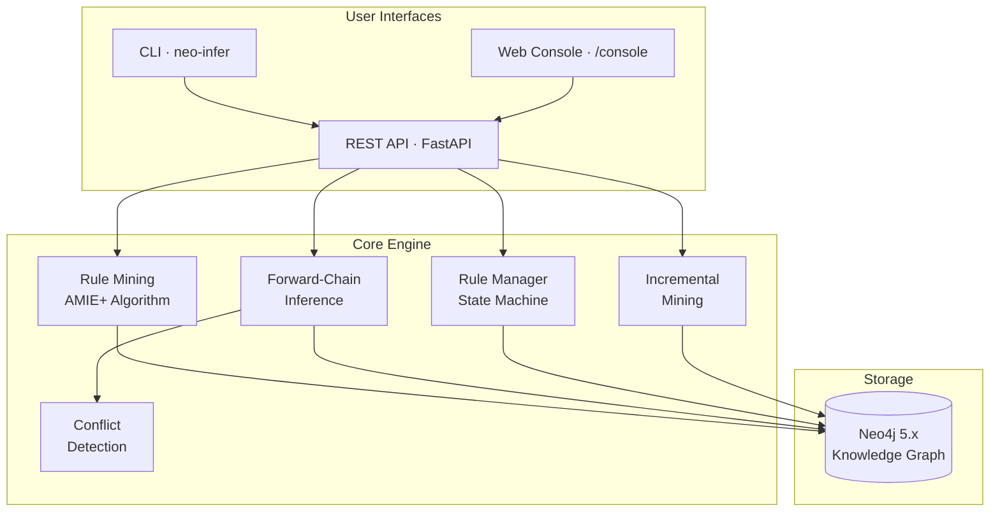

<div align="center">

# 🔮 neo-infer

**Teach your Neo4j graph to fill in its own blanks.**

Discover Horn-clause rules like `bornIn(X,Z) ∧ locatedIn(Z,Y) → nationality(X,Y)` straight from your data — then let the engine infer facts that were never explicitly stored.

[](https://github.com/zxr19980213/neo-infer/actions/workflows/ci.yml)
[](LICENSE)
[](https://www.python.org/downloads/)
[](https://neo4j.com/)

</div>

---

## ✨ The magic in 30 seconds

You have a graph. It's missing facts — every real graph is. Watch neo-infer find them:

```
   BEFORE                                    AFTER
   ──────                                    ─────
   alice ──bornIn──▶ beijing                 alice ──bornIn──▶ beijing
   bob   ──bornIn──▶ shanghai                bob   ──bornIn──▶ shanghai
   beijing  ─locatedIn─▶ china               beijing  ─locatedIn─▶ china
   shanghai ─locatedIn─▶ china               shanghai ─locatedIn─▶ china
   alice ──nationality──▶ china              alice ──nationality──▶ china
                                        ⚡    bob   ──nationality──▶ china   ← inferred!
```

Nobody told the graph that **bob is Chinese**. neo-infer *figured it out* — by mining the rule
`bornIn(X,Z) ∧ locatedIn(Z,Y) → nationality(X,Y)` from the facts it already had, then applying it.

No training. No labels. No manual rules. Just your graph, reasoning about itself.

## 🤔 Why neo-infer?

Knowledge graphs are always incomplete, and hand-writing rules to patch them doesn't scale. Academic [AMIE+](https://www.mpi-inf.mpg.de/departments/databases-and-information-systems/research/yago-naga/amie/) implementations prove it *can* be automated — but they're research prototypes, not services you can point at a live database.

**neo-infer turns that algorithm into a production tool:**

- 🚫 **No data export** — queries run directly against Neo4j. No ETL, no dump-and-reload.
- 🔄 **Full rule lifecycle** — discover → review → adopt/reject → apply, with a server-enforced state machine.
- ⚡ **Incremental mining** — as the graph changes, delta-based re-mining keeps rules fresh without recomputing everything.
- 🛠️ **Actually usable** — REST API, CLI, browser console, conflict detection, and 35 automated tests.

## 🚀 Quick Start

### Prerequisites

- Python ≥ 3.10
- Neo4j 5.x (Community Edition is fine; password must be ≥ 8 characters)

### Install & Run

```bash
pip install -e .
export NEO4J_URI="bolt://localhost:7687"
export NEO4J_USER="neo4j"
export NEO4J_PASSWORD="your_password"
uvicorn main:app --reload
```

Open **http://localhost:8000/console** for the web UI, or drive it from the CLI:

```bash
neo-infer health
neo-infer mine --body-length 2 --limit 100 --min-support 1 --min-pca-confidence 0.1
neo-infer rules list --status discovered
neo-infer infer --limit-rules 100
```

### ⏱️ Reproduce the magic (5 minutes)

```bash
# 1. Seed the sample graph from above
cypher-shell -a bolt://localhost:7687 -u neo4j -p your_password '
CREATE (a:Entity {id:"alice"}), (b:Entity {id:"bob"}),
       (bj:Entity {id:"beijing"}), (sh:Entity {id:"shanghai"}),
       (cn:Entity {id:"china"});
CREATE (a)-[:bornIn]->(bj), (b)-[:bornIn]->(sh),
       (bj)-[:locatedIn]->(cn), (sh)-[:locatedIn]->(cn),
       (a)-[:nationality]->(cn);'

# 2. Mine rules — discovers: bornIn(X,Z) ∧ locatedIn(Z,Y) → nationality(X,Y)
curl -X POST http://localhost:8000/rules/mine \
  -H "Content-Type: application/json" \
  -d '{"body_length":2, "limit":100, "min_support":1, "min_pca_confidence":0.1}'

# 3. Adopt the discovered rule
curl -X POST http://localhost:8000/rules/rule__bornin__locatedin__to__nationality/adopt

# 4. Run inference → bob now gets nationality → china (inferred!)
curl -X POST http://localhost:8000/inference/run \
  -H "Content-Type: application/json" \
  -d '{"limit_rules":100, "fixpoint":false}'
```

## 🧩 How it fits together


```mermaid
graph TB
    subgraph User Interfaces
        CLI["CLI · neo-infer"]
        API["REST API · FastAPI"]
        Console["Web Console · /console"]
    end

    subgraph Core Engine
        Mining["Rule Mining<br/>AMIE+ Algorithm"]
        Inference["Forward-Chain<br/>Inference"]
        RuleMgmt["Rule Manager<br/>State Machine"]
        Incremental["Incremental<br/>Mining"]
        Conflict["Conflict<br/>Detection"]
    end

    subgraph Storage
        Neo4j[("Neo4j 5.x<br/>Knowledge Graph")]
    end

    CLI --> API
    Console --> API
    API --> Mining
    API --> Inference
    API --> RuleMgmt
    API --> Incremental
    Inference --> Conflict
    Mining --> Neo4j
    Inference --> Neo4j
    RuleMgmt --> Neo4j
    Incremental --> Neo4j
```

## 🎁 Features

| Feature | Description |
|---------|-------------|
| **Rule Mining** | AMIE+ algorithm, body length 2~5, with beam search and pruning |
| **Inference** | Single-round and fixpoint forward-chaining, with conflict detection |
| **Rule Lifecycle** | State machine: `discovered → adopted → applied` / `rejected` |
| **Incremental Mining** | ChangeLog-driven delta mining with cursor-based consumption |
| **Web Console** | Browser UI at `/console` for mining, rule management, inference |
| **CLI** | `neo-infer` command for all operations |
| **Trigger Support** | APOC trigger for auto-capturing graph mutations (Neo4j 4.x/5.x) |
| **Benchmarking** | Built-in scripts for API performance and index strategy testing |

## 🎛️ Rule Mining Parameters

| Parameter | Default | Description |
|-----------|---------|-------------|
| `body_length` | 2 | Path hops (2~5). Length 2/3 use optimized queries; 4/5 use dynamic Cypher. |
| `min_support` | 5 | Minimum support count |
| `min_pca_confidence` | 0.1 | Minimum PCA confidence threshold |
| `factual_only` | true | Exclude inferred edges from statistics |
| `beam_width` | - | Top-B body candidates per level |
| `head_budget_per_relation` | - | Max K rules per head relation |
| `candidate_limit` | - | Max total candidates to evaluate |

## 🔁 Rule State Machine

```
discovered ──[adopt]──> adopted ──[inference]──> applied (terminal)
     │                      │
     └──────[reject]────────┴──────────────────> rejected (terminal)
```

The API enforces every transition: invalid transitions return `409 Conflict`, missing rules return `404`.

## 📚 Documentation

| Document | Content |
|----------|---------|
| [API Reference](docs/api-reference.md) | All endpoints, parameters, request/response examples |
| [Configuration](docs/configuration.md) | Environment variables, Neo4j/APOC setup, schema |
| [Testing & Benchmarks](docs/testing.md) | Automated tests, manual testing guide, benchmarks |
| [Architecture & Roadmap](docs/architecture.md) | Algorithm design, implementation plan, status |

## 🔧 Development

```bash
pip install -e ".[dev]"
pytest -q                  # 35 tests, all mocked (no Neo4j needed)
uvicorn main:app --reload  # dev server with hot reload
```

See [CONTRIBUTING.md](CONTRIBUTING.md) for guidelines — issues and PRs are very welcome.

## ☕ Support

neo-infer is built and maintained in my spare time. If it saved you the headache of hand-writing inference rules — *如果它帮你省下了手写规则的功夫* — there are two easy ways to say thanks:

⭐ **[Star the repo](https://github.com/zxr19980213/neo-infer)** — completely free, and it genuinely helps others discover the project. This is the #1 thing you can do.

<details>
<summary>💰 <b>Or buy me a coffee</b> (请我喝杯咖啡) — click to expand</summary>

<br/>

<div align="center">

Every coffee fuels another feature. Thank you! 🙏

**Alipay · 支付宝**


</div>

</details>

## 📄 License

[MIT](LICENSE) — free for commercial and personal use.

<div align="center">
<sub>Built with FastAPI + Neo4j · If neo-infer made your graph a little smarter, drop a ⭐</sub>
</div>
